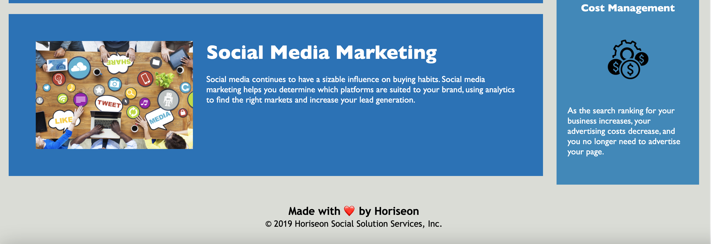

# Refactoring Horiseon's Web Page

## Motivation

The reason for refactoring the clients code was to simplfy and
make it easier to debug and follow semantically. The .html file
had too many non-semantic elements in it that did not give the
developer any information on what was inside those elements.
Changing non-semantic elements to semantic ones makes reading the
code and understanding where those elements fall on the actual
webpage much easier and more intuitive.

Many items in the .css file also needed to be change as they were
redundant and could be combined for ease of navigation and simplicity.
Items that are styled the same can be combined into one block to save
space make editing easier.

Updating these items helps modernize the code and makes it easier for
future developers to understand and read.

## Deployed website link:

## Sreenshot:

## License:
